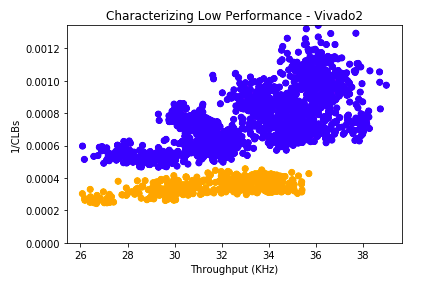

# Analysis of Design Space Output
In this document we note designs of interest with as orange points, the initial design as a red point, and all others as blue points.

## Design Space 1
The original design space philosophy is to be as generous as possible with loops that we knew would provide substantial benefit when given additional resources and to be as broad as possible with designs that were not guaranteed to improve as much with more resources. 

Running synthesis and place-and-route on Vivado generated 2016 results with 21 Pareto points. It is important to note that the initial design is a Pareto point and is the design with the smallest area. This is because every knob in the implementation is designed to increase area in an effort to increase performance. The graph shows that including loop unrolling and array partitioning could be used to increase performance when applied correctly but could also severely decrease performance when applied incorrectly. 

|  |
|:-----------------------:|
|       Figure 0          |

### Clusters
The output contains five clearly visible clusters which are all distributed on the x-axis. Thus it can be said that there are five different classifications of performance in our design space. We first attempt to characterize the fastest cluster. Through statistical analysis (details in the included Jupyter Notebook) we found that performance is high when copy1 is low, computehistogram is high, and computehistogram_partition is low. This means that in general the performance is not at its peak when the loops that copied array values to another array were unrolled very little and when the compute_histogram loop is unrolled more than its arrays are partitioned. In particular we find that we can capture most of the fast cluster's values when copy1 loops are unrolled by less than a factor of 8, when compute_histogram is unrolled by at least a factor of two and not partitioned at all, which gives Figure 1. If we relax the requirements and allow copy1 loops to be unrolled by any factor we can capture more of the fast cluster, but introduce some slower designs from the second slowest cluster. If we instead allow compute_histogram to be partitioned by a factor of two we can capture many more designs but introduce designs from the middle cluster. 

| |  |  |
|:---------------------:|:----------------------:|:----------------------:|
|   Figure 1            |      Figure 2          |      Figure 3          | 

We next classify lower performance clusters. Immediately upon study of the output table we notice that the slowest designs all have an unroll/partition factor of 8 on copy1 loops. We find that identifying these designs captures the slowest two clusters, shown in Figure 4. We can combine this conclusion with Figure 2 to determine that the slowest cluster must only include nodes in which the compute_histogram loop is unrolled by a factor less than its arrays are partitioned. Including this condition gives us Figure 5, which almost captures all of the designs in the slow cluster without including any from the next slowest.
 
|  |  |
|:----------------------:|:----------------------:|
|       Figure 4         |        Figure 5        |

We note that our analysis does not analyze the middle clusters nor does it mention the other knobs in the design space. This is because the knobs for complex loops did not contribute to performance significantly and only served to increase area and minutely affect performance.

## Design Space 2
The second design space is designed to be an improvement on the initial design space, where much more focus is put on loops which have the longest running time in an effort to provide a more significant performance benefit if the right combination of knobs was applied.
We also increased the potential values of the copy loop knobs to 16, which was also done in an effort to try to find more extreme designs for a sparser output graph.

Running synthesis and place-and-route on Vivado generated 1857 values with 8 Pareto points. It is clear from Figure 6 that the range of throughput is much lower in this design space and there are much fewer Pareto points than the initial design.

|  |
|:-----------------------:|
|       Figure 6          |

### Clusters

We analyze the designs based on performance in order to characterize the output graph. We first note upon analysis that copy1 again appears as a significant contributor to the difference in performance. We find that 

|   |    |
|:----------------------:|:----------------------:|
|       Figure 7         |        Figure 8        |

## Comparison